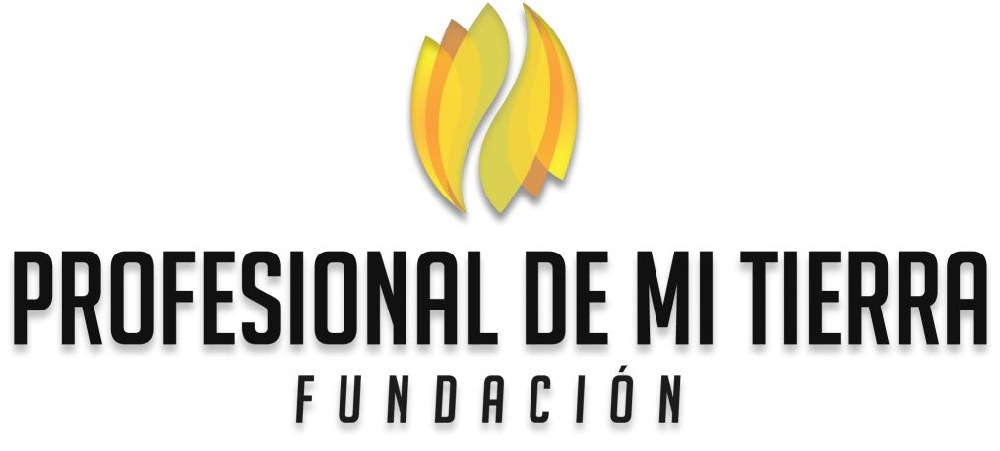

# 🤝 PROPUESTA DE ALIANZA

## Hackathon de Innovación: IA & Automatización 2026
### Fundación ProMiTierra

---

---

## 🌟 ¡Conviértete en Aliado del Hackathon!

---

## ¿Qué es el Hackathon ProMiTierra 2026?

Es un evento presencial de **innovación tecnológica** para jóvenes del Caquetá donde aprenderán a crear soluciones con **Inteligencia Artificial y Automatización**.

> *"No es solo una competencia, es un taller para aprender, crear y transformar el futuro con tecnología."*

---

## 🎯 Nuestro Objetivo

- Capacitar jóvenes en tecnologías de vanguardia
- Fomentar el emprendimiento tecnológico en la región
- Crear soluciones a problemas reales del Caquetá
- Generar oportunidades laborales para los participantes

---

## 👥 Público Objetivo

- **30-50 jóvenes** de 14 a 25 años
- Estudiantes de colegios y universidades del Caquetá
- Jóvenes emprendedores
- Principiantes y avanzados en tecnología

---

## 🤝 ¿Cómo Puedes Apoyar?

### 1.,Aporte de Espacios
- 📍 Préstamo de salón/auditorio para el evento
- 📍 Espacio para talleres y mentorías
- 📍 Conexión a internet de alta velocidad

### 2. Aporte de Equipos
- 💻 Computadores para participantes que no tengan
- 🔌 Extensiones, cargadores, adaptadores
- 📺 Proyector y pantalla
- 🎤 Equipos de audio

### 3. Aporte de Conocimiento
- 👨‍🏫 Tutores técnicos para acompañar equipos
- 👩‍🏫 Mentores de negocio/ideas
- 🎓 Charlas o talleres durante el evento

### 4. Aporte de Alimentación
- 🍕 Refrigerios para los participantes
- ☕ Café y bebidas
- 🍱 Almuerzos (si es evento de todo el día)

### 5. Aporte de Premios
- 🏆 Tablets o accesorios tecnológicos
- 📚 Cursos online o membresías
- 🛠️ Herramientas o materiales

### 6. Aporte de Transporte
- 🚐 Traslado para participantes de zonas rurales
- 🎫 Bonos de transporte

---

## 🎁 Beneficios como Aliado

| Beneficio | Aliado |
|-----------|--------|
| ✅ Logo en materiales del evento | Básico |
| ✅ Mención en redes sociales | Básico |
| ✅ Presencia en certificado de participantes | Básico |
| ✅ Booth/stand en el evento | Destacado |
| ✅ Oportunidad de dar Charla/Workshop | Destacado |
| ✅ Mención en prensa y medios | Premium |
| ✅ Sesión de reclutamiento de talento | Premium |

---

## 📅 Fechas del Evento

| Actividad | Fecha |
|-----------|-------|
| Inscripciones | Por definir |
| Hackathon (presencial) | Por definir |
| Entrega de proyectos | Por definir |
| Anuncio de ganadores | Por definir |

---

## 📍 ¿Qué deben preparar los participantes?

### Para los Estudiantes:
- 💻 Laptop propia (si tiene)
- 📱 Cuenta de GitHub
- 📧 Correo electrónico
- 💡 Ideas para su proyecto
- 📝 Cuaderno para notas

### Para los Tutores/Mentores:
- 📊 Temas que pueden enseñar
- 💻 Computador para demos
- 📚 Material de apoyo (opcional)

### Para la Institución:
- 📍 Espacio con tomas de corriente
- 🌐 Conexión a internet estable
- 🪑 Mesas y sillas para equipos

---

## 📞 Contáctanos

**Fundación ProMiTierra**

- 📱 Teléfono: +57 311 612 4993
- 🌐 Web: www.promitierra.org

---

## 📋 Cupón de Interés

**Institución/Empresa:** _______________________________________

**Nombre del representante:** _______________________________________

**Cargo:** _______________________________________

**Teléfono:** _______________________________________

**Email:** _______________________________________

**Tipo de apoyo que puede ofrecer:**

- [ ] Espacio físico
- [ ] Equipos
- [ ] Tutores/Mentores
- [ ] Alimentación
- [ ] Premios
- [ ] Transporte
- [ ]Otro: _______________________________________

**Observaciones:**

_______________________________________________________________

---

**¡Juntos hagamos posible este evento para los jóvenes del Caquetá!**

*Fundación ProMiTierra - Innovación con Sentido Humano*

